<p align="center"></p>

<h1 align="center">MeeTube</h1>

<p align="center">
<a href="https://github.com/yashoncode/meetube/releases/latest"></a>
<a href="LICENSE"></a>
<a href="https://github.com/yashoncode/meetube/releases"></a>
</p>

**YouTube, reimagined. Different by design. Smooth by nature.** <br><br> No ads. No interruptions. Just a gorgeous liquid glass interface, synced lyrics, background playback, and one-tap downloads.<br><br> **A fresh way to experience YouTube.**<br><br>

<p align="center">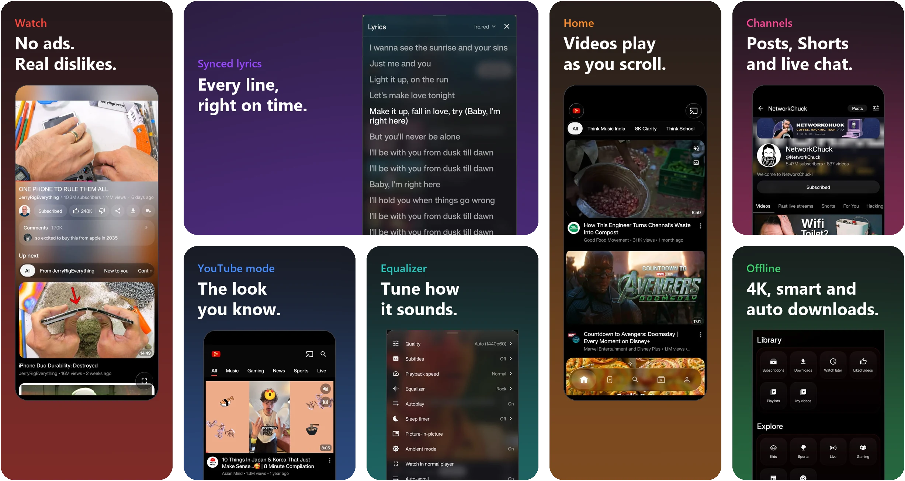</p>

<p align="center">
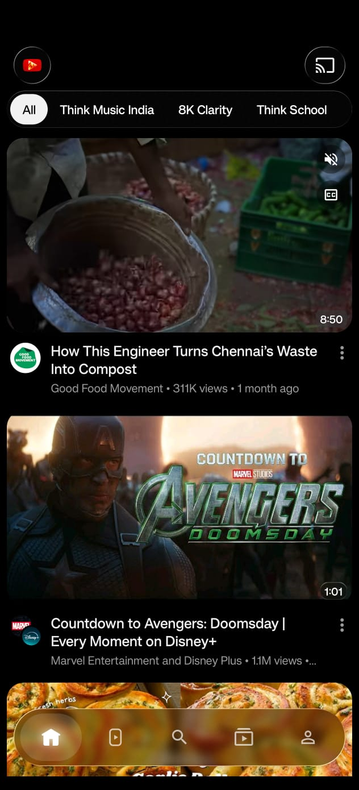
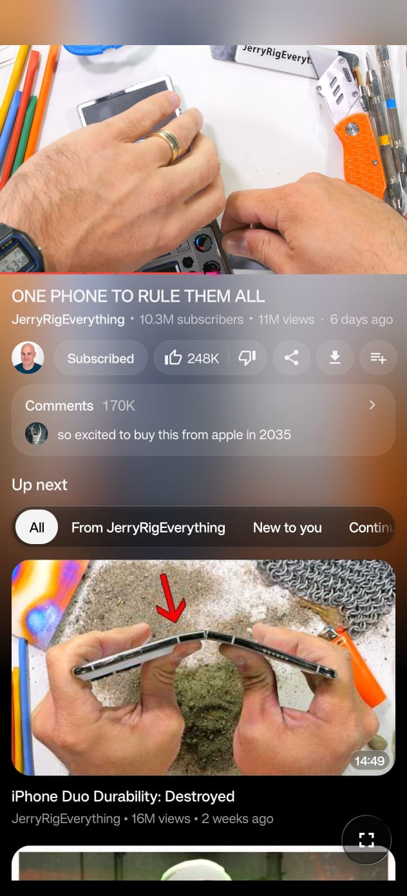
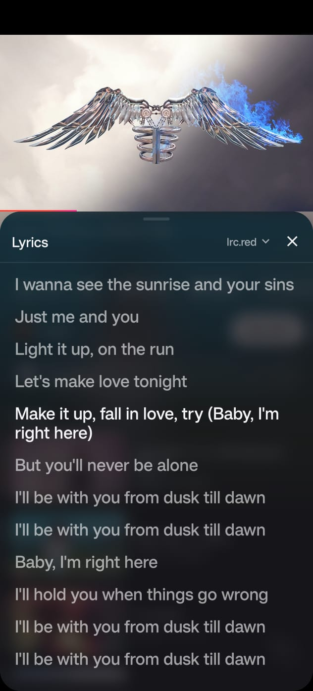
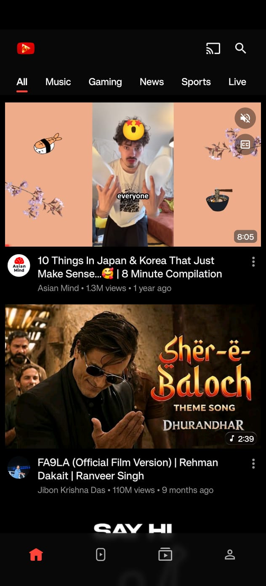
</p>

<p align="center"><a href="https://github.com/yashoncode/meetube/releases/latest"><b>⬇ Download the latest MeeTube</b></a></p>

<p align="center"><a href="#meetube-tv"><b>📺 On a TV? Get MeeTube TV</b></a></p>

> [!IMPORTANT]
> MeeTube is not affiliated with, endorsed by, or connected to YouTube or Google in any way. Use it at your own discretion.

## Features

<table>
<tr>
<td width="25%"></td>
<td width="25%"></td>
<td width="50%">

### Liquid glass, or YouTube mode
Frosted glass on the tab bar, the player and Shorts, lit by a glow that follows your tab. Videos on Home start playing as you scroll. Prefer the familiar look? **YouTube mode** docks a flat bar at the bottom and puts Search up top.

</td>
</tr>
<tr>
<td width="25%"></td>
<td width="25%">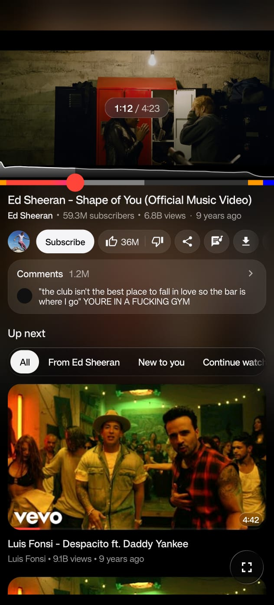</td>
<td width="50%">

### A player that shows more
The compact watch page puts the actions beside Subscribe and the top comments right under the video. A **Most replayed** graph rises over the seek bar, and seeking shows the real frame.

</td>
</tr>
<tr>
<td width="25%"></td>
<td width="25%">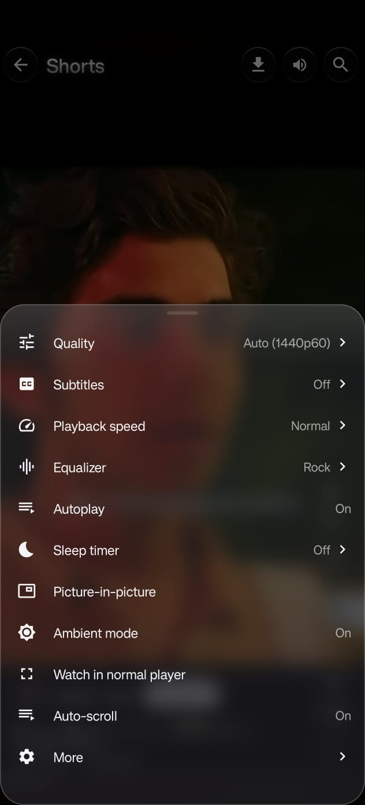</td>
<td width="50%">

### Synced lyrics and an equalizer
Music videos get live, line-by-line lyrics from the provider you pick. The **equalizer** sits in the player menu, with presets or your own bands applied live, original audio and volume up to 200%.

</td>
</tr>
<tr>
<td width="25%">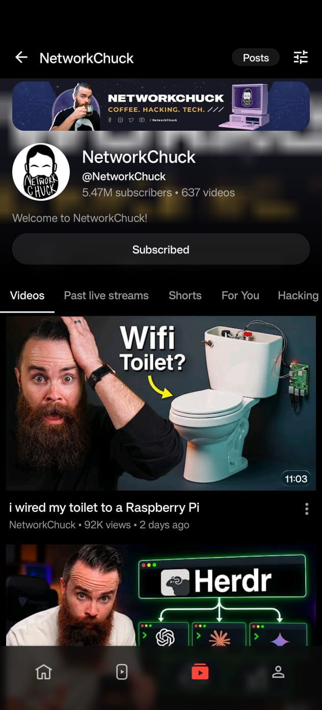</td>
<td width="25%">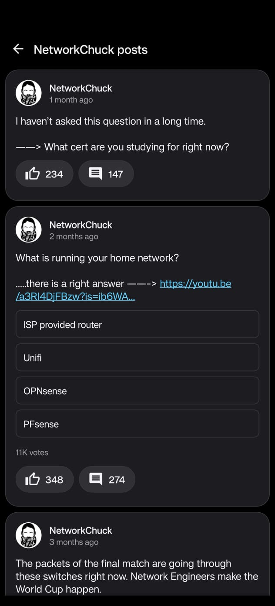</td>
<td width="50%">

### Channels, posts and live chat
Channel pages with the banner, Subscribe and every tab. Like and reply to **community posts**. On a live stream, **live chat** sits under the video, or beside it in fullscreen, and you can chat as any of your accounts.

</td>
</tr>
<tr>
<td width="25%">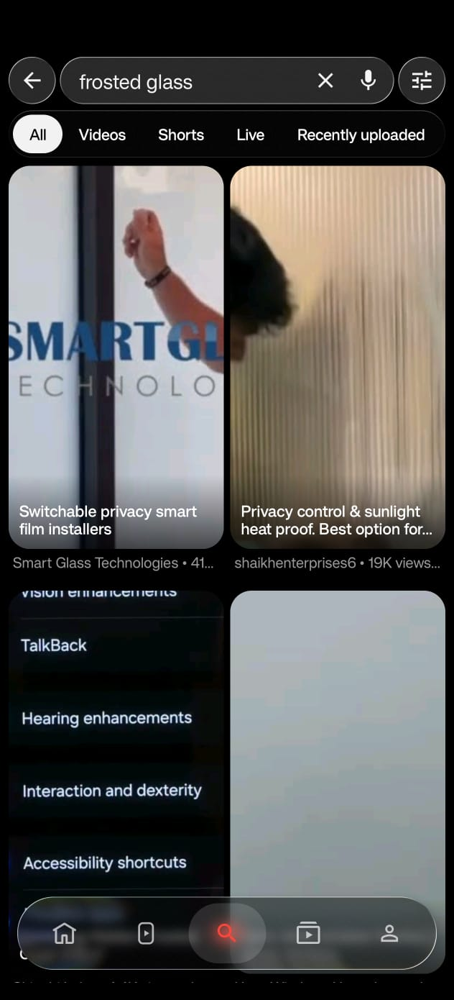</td>
<td width="25%">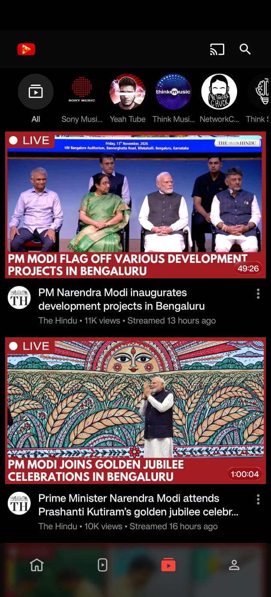</td>
<td width="50%">

### Search and Subscriptions
YouTube's one-tap chips for Videos, Shorts, Live and Recently uploaded, plus the full filter dialog. Your channels in a row on top of Subscriptions.

</td>
</tr>
<tr>
<td width="25%">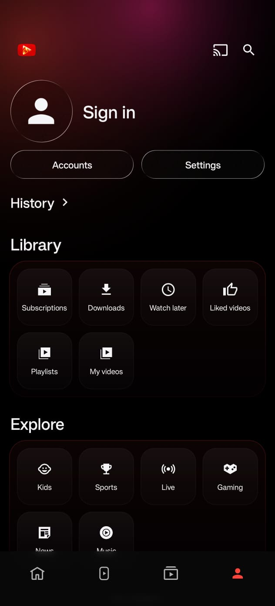</td>
<td colspan="2">

### Downloads in 4K, smart and automatic
Save videos up to **4K** in any folder you pick. **Smart downloads** remember your quality, so one tap saves. Turn on **auto download** and new uploads from the channels and playlists you choose download on their own.

</td>
</tr>
</table>

### And some more features I didn't forget (forgot many features to list :))

| | |
|---|---|
| 🚫 **No ads, no sponsors** | Ads are gone, and SponsorBlock skips sponsors, intros and "like and subscribe" reminders. |
| 👎 **Dislikes are back** | Return YouTube Dislike shows the real count, and DeArrow swaps clickbait titles and thumbnails. |
| 🎧 **Background play** | Lock the screen or switch apps and it keeps playing, with picture-in-picture for videos and Shorts. |
| 📱 **Shorts done right** | A clean full-screen player with glass like, comment and share buttons. |
| 🎨 **Make it yours** | Theme, light or dark, app icon, glass, Home layout, tabs and the video menu, all on one page. |
| 🌏 **Speaks your language** | English, Español, Polski, Português (Brasil), Română, Русский, 简体中文, 繁體中文 and العربية. [Help translate](TRANSLATING.md). |
| 🔐 **Your account** | Sign in with a code, or use it without an account. Cast to your TV. |

## Download

Get the APK for your phone from [Releases](https://github.com/yashoncode/meetube/releases/latest):

| Your device | File |
|:--|:--|
| Most phones (64-bit) | `MeeTube_<version>_arm64-v8a.apk` |
| Older phones (32-bit) | `MeeTube_<version>_armeabi-v7a.apk` |
| Not sure | `MeeTube_<version>_universal.apk` |

Android 7.0 or later.

Every release is built and signed in public by [GitHub Actions](https://github.com/yashoncode/meetube/actions/workflows/release.yml) from this repository's source, so you can see exactly how each APK was made.

## MeeTube TV

MeeTube's glass design on Android TV and Google TV, tuned its own way. It installs as its own app and updates itself.

- **Glass Home.** A frosted sidebar with a focus pill that glides between MeeTube's icons.
- **Glass player.** One frosted panel at the bottom: a seek bar with a glowing knob, and every button in a single row.
- **Search that glows.** The screen's edges light up when Search opens, and your words glow as you type.

<p align="center">
<a href="https://github.com/yashoncode/meetube-tv"></a>
<a href="https://github.com/yashoncode/meetube-tv"></a>
<a href="https://github.com/yashoncode/meetube-tv"></a>
<a href="https://github.com/yashoncode/meetube-tv"></a>
</p>

<p align="center"><a href="https://github.com/yashoncode/meetube-tv"><b>📺 Get MeeTube TV for your Android TV</b></a></p>

Downloads, the changelog and the code all live in [meetube-tv](https://github.com/yashoncode/meetube-tv). Get the newest APK from its [latest release](https://github.com/yashoncode/meetube-tv/releases/latest), and report TV bugs in its [issues](https://github.com/yashoncode/meetube-tv/issues).

## Build

```
./gradlew :mobile:assembleStmobileDebug     # debug, for testing
./gradlew :mobile:assembleStmobileRelease   # release, signed with keystore.properties if present
# APKs: mobile/build/outputs/renamed_apks/stmobile<Type>/MeeTube_<version>_<abi>.apk
```

Releases are made by pushing a `vX.Y.Z` tag: [release.yml](.github/workflows/release.yml) builds the signed APKs and publishes the GitHub release with its changelog. The glass is `mobile/src/stmobile/java/com/newtube/mobile/ui/common/GlassView.java`; the README showcase comes from `python tools/render_showcase.py`. Clone with `--recurse-submodules`. The backend lives in the `MediaServiceCore` and `SharedModules` submodules (MeeTube's own forks). Add `-PemulatorAbi` to run on an x86_64 emulator. Developer notes are in [CLAUDE.md](CLAUDE.md).

## Support MeeTube

Behind every little feature are hours of my life, a few sleepless nights, and a lot of hope that someone out there finds it useful.

❤️ If you love my work, buy me a coffee. ☕<br>
If you don't, maybe buy me a tea? 🍵

No pressure, though. I built this with love, not expectations. ❤️

<p align="center"><a href="https://buymeacoffee.com/yashwynth"></a></p>

In India? Scan to send a coffee (or a chai) over UPI (`yashwynth@slc`):

<p align="center"></p>

A star on GitHub or sharing MeeTube with a friend helps just as much. Thank you for using it! ❤️

## Credits

Big thanks to [SmartTube](https://github.com/yuliskov/SmartTube) by [@yuliskov](https://github.com/yuliskov) and [NewTube](https://github.com/aleixrodriala/newtube) by [@aleixrodriala](https://github.com/aleixrodriala). Their open source work made MeeTube and MeeTube TV possible.

Headphone correction uses the profiles from [AutoEq](https://github.com/jaakkopasanen/AutoEq) by [@jaakkopasanen](https://github.com/jaakkopasanen).

And thank you to everyone who sent a fix, reported a bug or suggested an idea. MeeTube is better because of you:

<p align="center">
<a href="https://github.com/KrishnakantShedge" title="KrishnakantShedge"></a>
<a href="https://github.com/Ishaanj2007" title="Ishaanj2007"></a>
<a href="https://github.com/alibinarshad" title="alibinarshad"></a>
<a href="https://github.com/sushi1579" title="sushi1579"></a>
<a href="https://github.com/y4hya3" title="y4hya3"></a>
<a href="https://github.com/dhanunjay333i-cyber" title="dhanunjay333i-cyber"></a>
<a href="https://github.com/y198h" title="y198h"></a>
<a href="https://github.com/editmatrix" title="editmatrix"></a>
<a href="https://github.com/94Dan" title="94Dan"></a>
<a href="https://github.com/Evergreenpro" title="Evergreenpro"></a>
<a href="https://github.com/Batmancpu" title="Batmancpu"></a>
<a href="https://github.com/karthick4568" title="karthick4568"></a>
<a href="https://github.com/Hrcosmos" title="Hrcosmos"></a>
<a href="https://github.com/abdulsamiamiri11-lang" title="abdulsamiamiri11-lang"></a>
<a href="https://github.com/m0in01" title="m0in01"></a>
<a href="https://github.com/mygtvact" title="mygtvact"></a>
<a href="https://github.com/ra-rear" title="ra-rear"></a>
<a href="https://github.com/harshXigll" title="harshXigll"></a>
<a href="https://github.com/AshUchiha3" title="AshUchiha3"></a>
<a href="https://github.com/abanbinarshadmail-dotcom" title="abanbinarshadmail-dotcom"></a>
<a href="https://github.com/jokychan797-stack" title="jokychan797-stack"></a>
<a href="https://github.com/Capricornus007" title="Capricornus007"></a>
<a href="https://github.com/Reird" title="Reird"></a>
<a href="https://github.com/MAKAKAIglitch" title="MAKAKAIglitch"></a>
<a href="https://github.com/sakuraDev31" title="sakuraDev31"></a>
<a href="https://github.com/SpadezOfSpadez" title="SpadezOfSpadez"></a>
<a href="https://github.com/Golukumar00" title="Golukumar00"></a>
<a href="https://github.com/froost4" title="froost4"></a>
<a href="https://github.com/kazierski" title="kazierski"></a>
<a href="https://github.com/Hammoudi99" title="Hammoudi99"></a>
<a href="https://github.com/kadheerk49" title="kadheerk49"></a>
<a href="https://github.com/GeorgAR" title="GeorgAR"></a>
<a href="https://github.com/akshaymaurya26" title="akshaymaurya26"></a>
<a href="https://github.com/muksidulrahman077-creator" title="muksidulrahman077-creator"></a>
<a href="https://github.com/upt8543-eng" title="upt8543-eng"></a>
<a href="https://github.com/debugging03" title="debugging03"></a>
<a href="https://github.com/DarkGGM" title="DarkGGM"></a>
<a href="https://github.com/Abinpj1" title="Abinpj1"></a>
<a href="https://github.com/Subbarao6338" title="Subbarao6338"></a>
<a href="https://github.com/sauravdahalbro-ui" title="sauravdahalbro-ui"></a>
</p>

## License

MIT, see [LICENSE](LICENSE). The original NewTube and SmartTube copyright notices are kept. See [THIRD_PARTY_NOTICES.md](THIRD_PARTY_NOTICES.md).
